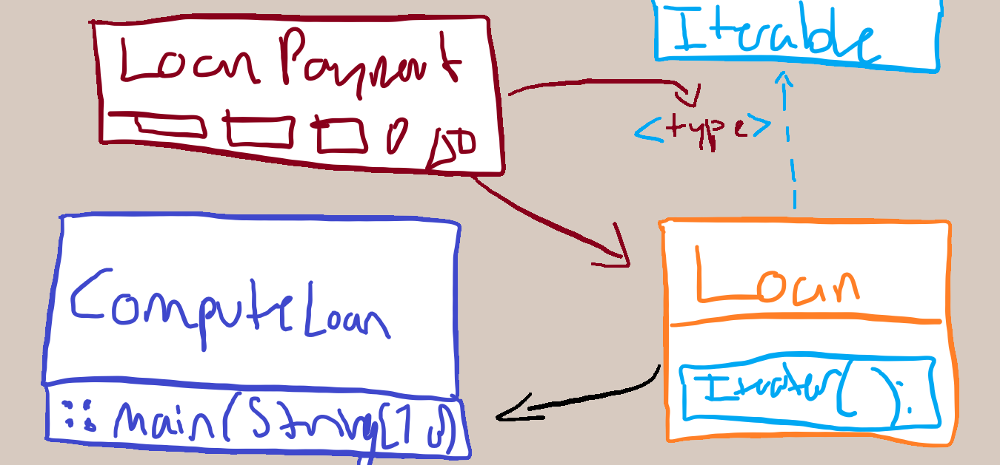

# 5.22 - Loan Amortization Schedule

Requires at least JDK 10.

```sh
javac *.java
```

What is one supposed to put in here?
Some UML diagrams for the suits?



I would have added more `AbstractSingletonProxyFactoryBean`s but I simply didn't
have the time.
