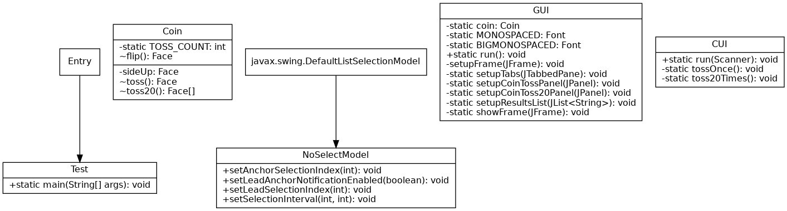

# Part 2 - Coin Toss Simulator

Create a coin toss simulation program.
The simulation program should toss coin randomly and track the count of heads or tails.

You need to write a program that can perform following operations:

1. Toss a coin randomly.
2. Track the count of heads or tails.
3. Display the results.

### Design and Test

- Let's decide what classes, methods and variables will be required in this task and their significance:

- Write a class called **Coin**.

- The Coin class should have an Instance variable sideUp.
The sideUp field will hold either "heads" or "tails" indicating the side of the coin that is facing up.

- The Coin class should have following methods:
   - A void method named toss, which simulates the tossing of a coin. When the toss method is called, it randomly determines the side of the coin that is facing up ("heads" or "tails") and sets the sideUp field accordingly.

   - A no-arg constructor, which randomly determines the side of the coin, that is facing up ("heads" or "tails") and initializes the sideUp field accordingly.

   - A method named getSideUp that returns the value of the sideUp field.

   - Create a toss method that uses loop to toss the coin 20 times.
   Each time the coin is tossed, display the side that is facing up.
   The method should keep count of the number of times heads or tails is facing
   up and display those values after the loop finishes.

- Write the test program, which has main method and demonstrates the Coin class.

Submit a class diagram, test runs and code (.java file) with your submission.
Please create a zip file and submit a single attachment for part 2.

# Submission

## Test Run

```
Please select your preferred display option:
Please enter a number (default 0)
[0] Console
[1] GUI
> 0
What should I do?
[0] Toss the coin once
[1] Toss the coin twenty times
[2] Quit
> 0
heads
> 1
tails
heads
tails
heads
tails
heads
tails
tails
heads
tails
tails
heads
tails
heads
tails
heads
heads
tails
heads
heads
Heads: 10
Tails: 10
> 2
```

## GUI


## UML Class Diagram


