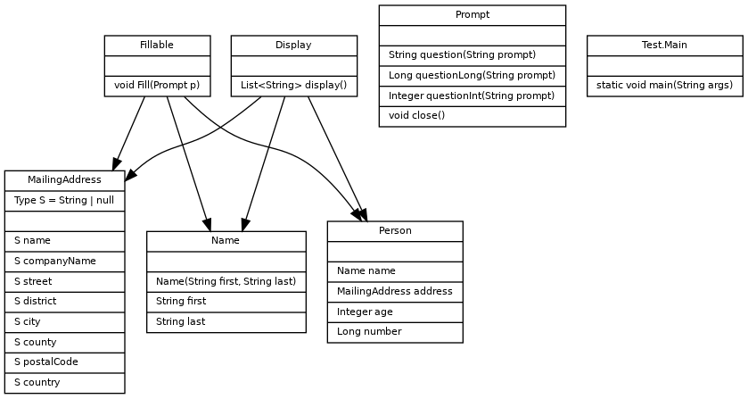

# Part 1 - Personal Information Class

Design a class that hold the personal data: name, address, age and phone number.
Write appropriate methods (constructor, getters ad setters.
Demonstrate the class by writing a program that creates three instances of the class.
You can populate information in each object using Scanner class.
Please do not use any personal information as data in the project.

Submit a class diagram, test runs and code (.java file) with your submission.
Please create a zip file and submit a single attachment for part 1.

# Submission

The class diagram is in `UML.png`



### Test Run

```
java -jar PersonalInformation.jar
Person {
   Name: Payne, Winston
   Address {
      1736 Boulay Boulevard
      Los Angeles
      Washington
      74033
      United States of Russia
   }
   Age: 52
   Phone Number: 5226091186
}
Person {
   Name: Von Karma, Franziska
   Address {
      M?�nchener Str. 56
      Frankfurt
      60329
      Germany
   }
   Age: 18
   Phone Number: 19947198094
}
```
