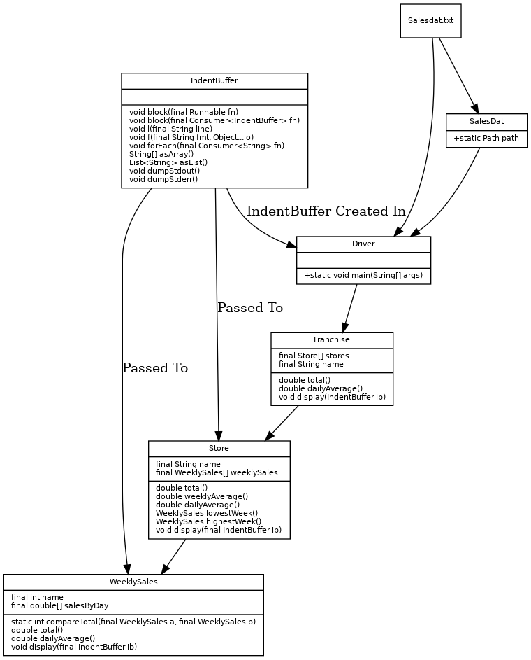

# Assignment 336b

The name of this reminds me of Form33B from Raven Kwok.

Write a program that opens the salesdat.txt file and processes it contents.
The program should display the following per store:

- The total sales for each week. (Should print 5 values - one for each week).
- The average daily sales for each week. (Should print 5 values - one for each week).
- The total sales for all the weeks. (Should print 1 value)
- The average weekly sales. (Should print 1 value)
- The week with the highest amount in sales. (Should print 1 week #)
- The week with the lowest amount in sales. (Should print 1 week #)
- All Values (Total Sales, Average Daily Sales for Each Week, Total Sales for
all Weeks, Average Weekly Sales, Highest Amount in Sales, Lowest Amount in Sales)

The file contains the dollars amount of sales that a retail store made each day
for a number of weeks. Each line in the file contains thirty five numbers, which
are sales numbers for five weeks. The number are separated by space.
Each line in the file represents a separate store.

Please make sure that you:

1. Add a class diagram with your submission.
2. Add comments to your code in FileIO class.
3. Make sure you adequately test your code.
4. Provide a user-friendly interface (Console based).

# Submission

The build system is just a simple Makefile.
It probably only works on Windows.

### 1.

I did the class diagram in a different way this time.
Instead of showing inheritance, which is not that useful, I showed the
relationship between classes and their use in the code.

### 2.

The `FileIO` class was not needed. Entrypoint is `Driver`.

### 3.

A test run is located in [test_run.txt](test_run.txt).

I also learned a little bit of JUnit for this project. All JUnit tests passed.
The output is in [junit_run.txt](junit_run.txt).

### 4.

Given that the program is not interactive, I suppose the user interface is
pretty friendly, given how nice the output is.
