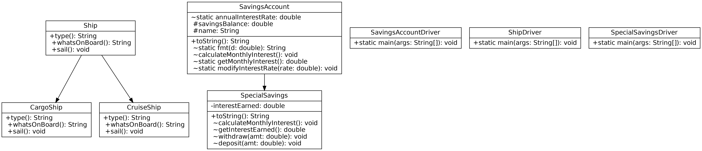

# lab4 submission

As usual, compiled with regular ol' `javac`.

## Class Diagram

This is the first time that I get to use my tool to autogenerate it.
[Source for the generator is on my GitHub](https://github.com/coalpha/uml-jenerate)

## Test Runs

- [TEST_SAVINGS_ACCOUNT.txt](TEST_SAVINGS_ACCOUNT.txt)
- [TEST_SPECIAL_SAVINGS.txt](TEST_SPECIAL_SACINGS.txt)
- [TEST_SHIP.txt](TEST_SHIP.txt)
