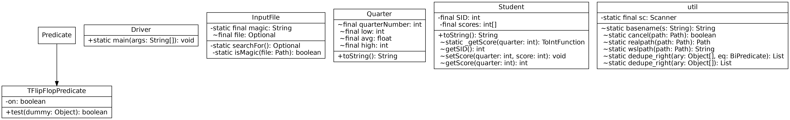

# lab5 submission

Here's the output:

```h
No path provided in command line arguments.
Searching...
Working with .\input.txt
Quarter 1 {
   low : 0
   avg : 46.20
   high: 100
}
Quarter 2 {
   low : 7
   avg : 42.33
   high: 100
}
Quarter 3 {
   low : 0
   avg : 70.47
   high: 100
}
Quarter 4 {
   low : 32
   avg : 75.67
   high: 90
}
Quarter 5 {
   low : 10
   avg : 49.73
   high: 80
}
```

And here's the UML diagram, generated by uml-jenerate:


